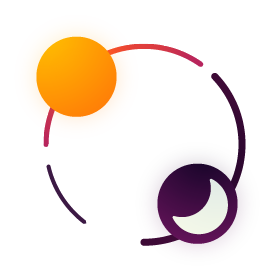

<p align="center">
<a href="https://melpa.org/#/circadian" target="_blank">
  
</a>
<a href="https://travis-ci.org/guidoschmidt/circadian.el" target="_blank">
  
</a>
<br>
<br>
<br>


<h1 align="center">circadian</h1>
<h3 align="center">Theme-switching for Emacs based on daytime</h3>
</p>

### Why?
Circadian tries to help reducing eye strain that may arise
from difference of your display brightness and the
surrounding light.

Inspired by color temperature shifting tools and brightness
adaption software like:
- [redshift](https://wiki.archlinux.org/index.php/Redshift)
- [f.lux](https://justgetflux.com/news/pages/mac/)
- [Lumen](https://github.com/anishathalye/lumen)

### Example usage
Example usage with default themes (leuven at 7:30, wombat at 19:30):
```elisp
(use-package circadian
  :ensure t
  :config
  (circadian-setup))
```

Example usage featuring [hemera-themes](https://github.com/GuidoSchmidt/emacs-hemera-theme)
and [nyx-theme](https://github.com/GuidoSchmidt/emacs-nyx-theme) (with use-package):

```elisp
(use-package circadian
  :load-path "~/.emacs.d/config/circadian/"
  :ensure t
  :config
  (setq circadian-themes '(("8:00" . hemera)
                           ("19:30" . nyx)))
  (circadian-setup))
```

---

### Themes
Circadian features two themes - [Nyx (nighttime)](https://github.com/GuidoSchmidt/emacs-nyx-theme)
and [Hemera (daytime)](https://github.com/GuidoSchmidt/emacs-hemera-theme)

---

### TODOs & Ideas
- Possible to interpolate colors of themes?
- Query brightness sensors of laptops?
- Extend tests
- Load themes by mode [reddit.com/r/emacs](https://www.reddit.com/r/emacs/comments/72ukrx/theme_preferences/)
- Load themes by machine name [reddit.com/r/emacs](https://www.reddit.com/r/emacs/comments/72ukrx/theme_preferences/)
- Load themes by wifi/location? [reddit.com/r/emacs](https://www.reddit.com/r/emacs/comments/72ukrx/theme_preferences/)
- Use emacs builtin sunrise-sunset feature (see Issues)
