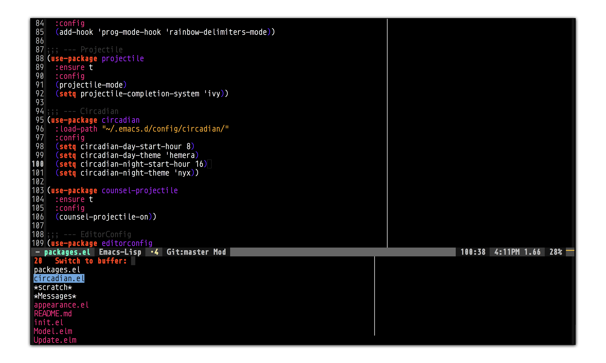
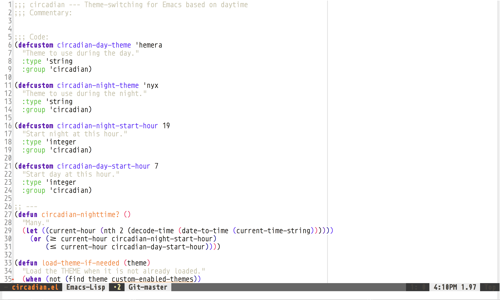

# circadian
> Theme-switching for Emacs based on daytime

- Color temperature shifting and screen adaption based on daytime
- [redshift](https://wiki.archlinux.org/index.php/Redshift)
- [f.lux](https://justgetflux.com/news/pages/mac/)
- [Lumen](https://github.com/anishathalye/lumen)

### Usage
- Clone this repository into your `.emacs.d/` directory
- Add this to your `init.el` (with use-package):

```elisp
(use-package circadian
  :load-path "~/.emacs.d/circadian/"
  :config
  (setq circadian-day-start-hour 8)
  (setq circadian-day-theme 'hemera)
  (setq circadian-night-start-hour 21)
  (setq circadian-night-theme 'nyx))
```

---

### Themes
Circadian features two themes: Nyx & Hemera, you can find them in the `themes` directory.
To enable them in emacs use the following:

```elisp
(add-to-list 'custom-theme-load-path "~/.emacs.d/circadian/themes/")
```

#### Nyx


#### Hemera


---

### TODO
- Better settings for daytimes (day/night), with minutes
- Find another way to switch themes than using switch-buffer? Hook for clock?
- Possible to interpolate-colors?
